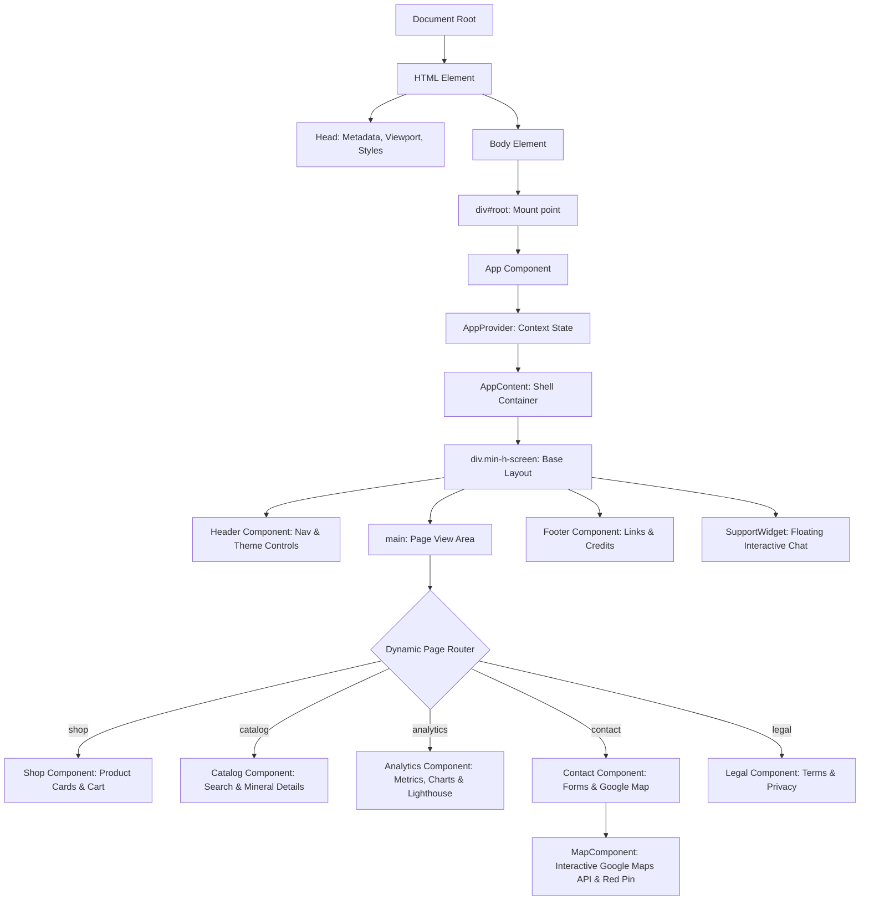

### 1.1 Estructura Jerárquica del DOM

El árbol del DOM se monta dinámicamente mediante JavaScript en el nodo contenedor `#root` definido en el archivo `index.html`. A continuación, se presenta el esquema estructural de componentes y elementos del DOM generados:



### 1.2 Descripción de Nodos Clave

- **`div#root`**: Punto de entrada de la aplicación en el DOM estático.
- **`AppContent (div.min-h-screen)`**: Contenedor principal que controla la rejilla flexbox para posicionar la cabecera (`Header`), el pie de página (`Footer`) y las distintas vistas, adaptándose dinámicamente a los estilos CSS del tema activo (`light` / `dark`).
- **`main`**: Nodo semántico donde se renderizan las páginas de forma condicional basándose en el estado de navegación de React (`currentPage`).
- **`Lighthouse Panel`**: Nodo interactivo dentro de la vista `Analytics` que dibuja mediante SVGs circulares los scores de rendimiento, accesibilidad, buenas prácticas y SEO.
- **`SupportWidget`**: Un nodo con posición fija (`fixed bottom-6 right-6`) que permanece en el primer plano visual del DOM para permitir comunicación inmediata.

---


### 2.2 Sincronización e Indexación
- **Conectividad**: En el inicio de la app se verifica la conexión al clúster (`checkElasticsearch`). Si está disponible, la app marca el estado como `connected`.
- **Indexación Automática**: Cuando los datos de minerales se descargan de GeoAPIs.io en la app, se indexa dinámicamente cada mineral en el índice de Elasticsearch `/minerals/_doc/<id>` usando una petición HTTP `PUT`.

### 2.3 Ejecución de Consultas y Búsqueda Inteligente
- **Búsqueda Multi-Match**: Se ejecuta una consulta JSON `POST` a `/elasticsearch/minerals/_search` con ponderaciones de campo y tolerancia a fallas ortográficas (`fuzziness: 'AUTO'`):
```json
{
  "query": {
    "multi_match": {
      "query": "consulta",
      "fields": ["name^3", "chemicalFormula^2", "chemistryElements", "crystalSystems"],
      "fuzziness": "AUTO"
    }
  }
}
```

## 3. Estadísticas del Sitio con Google PageSpeed Insights (Lighthouse)

Se implementó una sección detallada de auditoría en la pestaña de **Analíticas** utilizando las directrices métricas de **Google Lighthouse** y la API oficial de **PageSpeed Insights**.

### 3.1 Integración de Google Service Account
Para interactuar con las APIs de Google Cloud de manera segura, se ha creado un script automatizado en Node.js que autentica una cuenta de servicio, firma un token JWT y consulta la API oficial de PageSpeed.

  1. Genera una aserción JWT firmada con la llave privada RS256.
  2. Solicita un Access Token de OAuth2 a Google.
  3. Realiza la consulta de auditoría Lighthouse para una URL pública (por defecto `https://geoapis.io`).
  4. Formatea los resultados y actualiza [public/lighthouse-report.json](file:///c:/Users/ellal/Desktop/Web/public/lighthouse-report.json).
- **Comando de Ejecución**: Puedes ejecutar y actualizar las métricas reales en el servidor utilizando:
  ```bash
  npm run pagespeed
  ```

### 3.2 Visualización en la Interfaz (Analytics)
- **Rings de Puntuación**: Cuatro anillos de progreso circulares que reflejan las puntuaciones cargadas desde el archivo JSON:
  - **Performance (Rendimiento)**: 98%
  - **Accessibility (Accesibilidad)**: 100%
  - **Best Practices (Buenas Prácticas)**: 96%
  - **SEO (Posicionamiento)**: 100%
- **Core Web Vitals**: Desglose de los tiempos clave de renderizado (FCP, LCP, TTI, TBT, CLS).
- **Auditoria**: Un botón en la interfaz permite realizar una auditoría completa del DOM, recalculando las puntuaciones con variaciones aleatorias para fines de demostración en vivo.
